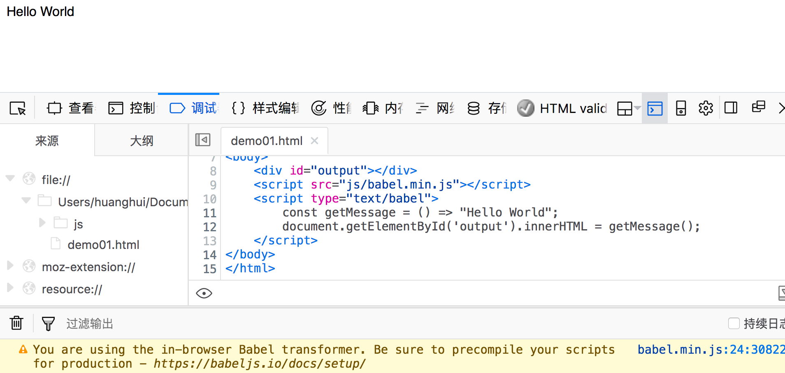
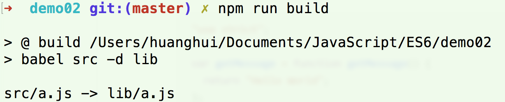
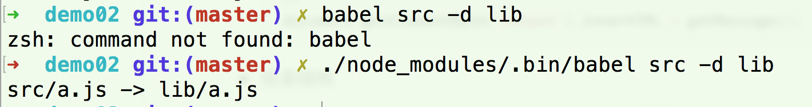
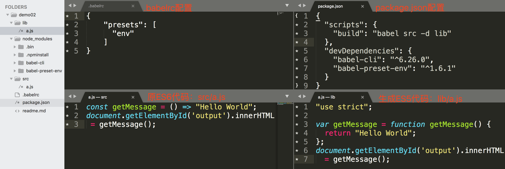

# ES6学习

ES6不是全面兼容，如果兼容，需要通过babel进行转译。


## 介绍一下babel用法
### 1、浏览器中的用法

- 注意js中的type值必须写`text/babel`，代码如下：

    ```html
    <div id="output"></div>
    <script src="js/babel.min.js"></script>
    <script type="text/babel">
      const getMessage = () => "Hello World";
      document.getElementById('output').innerHTML = getMessage();
    </script>
    ```

- 浏览器访问效果：

    

> 详见[demo01](demo01/demo01.html)


### 2、终端中的用法 Node

- 安装两个插件，babel-cli 和babel-preset-env： `cnpm install --save-dev babel-cli babel-preset-env`

- 新创建`.babelrc`文件，添加配置：

    ```json
    {
        "presets": [
          "env"
        ]
    }
    ```

- 在src目录下面新建一个a.js

    ```js
    const getMessage = () => "Hello World";
    document.getElementById('output').innerHTML = getMessage();
    ```

- 可在`package.json`中添加快捷键`scripts` ：

    ```json
    {
        "scripts": {
            "build": "babel src -d lib"
        },
        "devDependencies": {
            "babel-cli": "^6.26.0",
            "babel-preset-env": "^1.6.1"
        }
    }
    ```

- 终端执行：`cnpm run build`

    

- 如果不配置package.json，则执行命令为：`./node_modules/.bin/babel src -d lib` 。由于babel不是全局变量。

    

- 生成文件` lib/a.js`，代码如下：

    ```js
    "use strict";

    var getMessage = function getMessage() {
      return "Hello World";
    };
    document.getElementById('output').innerHTML = getMessage();
    ```

- 目录结构以及效果如下：

    


